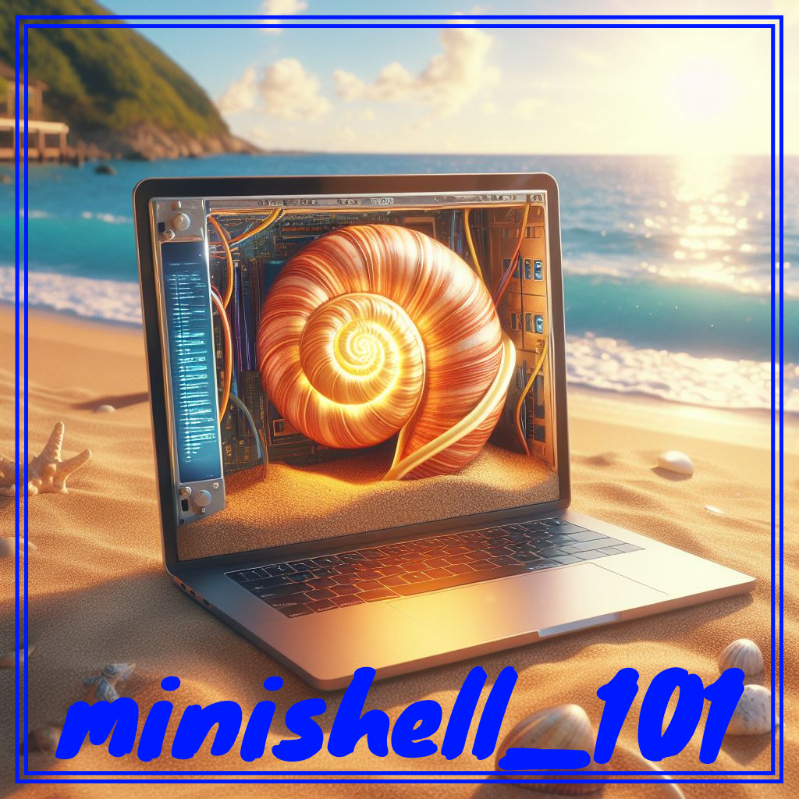

  

 
## [**GO TO SUMMARY**](https://github.com/maitreverge/minishell_101/tree/master/sommaire)

## 🚀 WHAT IS MINISHELL ?

The `minihell` project at 42 immerses students in UNIX shell development using C, focusing on system calls, process management, and parsing.

It challenges them to create a minimalistic shell with fundamental UNIX command-line functionalities, fostering skills in system-level programming and imparting practical knowledge of core shell components.  
    
## 🤔 WHAT'S THE POINT OF THIS REPO ?

The creation of this GitHub repo was the result of a reflection among 42 students during our minishell project:

- **Centralize** and **organize** resources of all kinds (*shell scripts and other languages, explanatory README.md files, unique web resources*) to give a `minishell` project overview for students.

## SUMMARY :

- [EDGE_CASES](https://github.com/maitreverge/minishell_101/tree/master/ressources/edge_cases/)
- [FUNCTIONS OVERVIEW](https://github.com/maitreverge/minishell_101/tree/master/ressources/functions_overview/)
- [VALGRIND READLINE](https://github.com/maitreverge/minishell_101/tree/master/ressources/valgrind_realine)

🚀 Happy coding!
