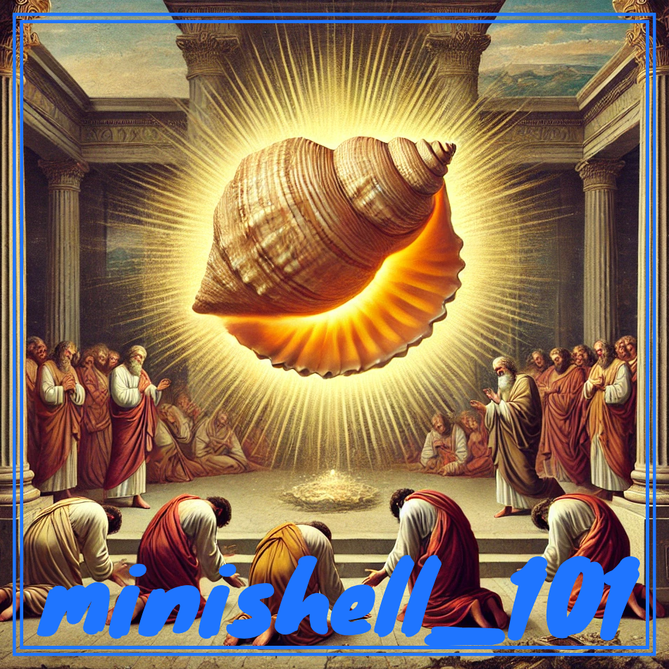

  

## [**REPO SUMMARY**](https://github.com/maitreverge/minishell_101/tree/fa7aa41f274a86e0df12822a12d2d8b54bafdb89/sommaire)

## 🚀 WHAT IS MINISHELL ?

The `minihell` project at 42 immerses students in UNIX shell development using C, focusing on system calls, process management, and parsing.

It challenges them to create a minimalistic shell with fundamental UNIX command-line functionalities, fostering skills in system-level programming and imparting practical knowledge of core shell components.

## 🤔 WHAT'S THE POINT OF THIS REPO ?

The creation of this GitHub repo was the result of a reflection among 42 students during our minishell project: far too many of us (myself included) are unfamiliar with Github collaboration tools, and we all lack training in them.

So I created this repo with two main goals in mind:

- **Centralize** and **organize** resources of all kinds (*shell scripts and other languages, explanatory README.md files, stackoverflow web resources*) to give an `minishell` project overview for future students.

- Be a common **training ground** for GitHub collaboration tools (*Pull Request creation, Git Issues, .md file redactions*).

## 🤝 WHAT CAN I SHARE /  HOW DO I CONTRIBUTE ?

You're going to create a 😱**PULL REQUEST**😱.
I know I know, this is scary... you can do it !

[**Unfamiliar with pull requests ? Click Here !**](https://googlethatforyou.com/?q=how%20to%20make%20a%20github%20pull%20request)

- Did you create a custom Python Script for checking a minishell specific requirement ?

- You wrote a useful readme.md where you explain useful infos?

- You found a usefull ressource about bash ?

Open a Pull Request, and **don't be afraid to mess things up** !

For keeping everything nice and intelligible, here is the global structure of the repo :

  

⚠️**I'd expect two things from you** ⚠️ :

- Add a directory with your GitHub username in the [**ressources directoy**](https://github.com/maitreverge/minishell_101/tree/fa7aa41f274a86e0df12822a12d2d8b54bafdb89/ressources).
Try to make your work as explicit and comprehensible as possible (*with a README.md for example*)

- Link your work in the [**summary README.md**](https://github.com/maitreverge/minishell_101/blob/fa7aa41f274a86e0df12822a12d2d8b54bafdb89/sommaire/README.md)
(*fell free to add a category within this file if your work doesn't match any*)

From here, you are absolutely free to organize your files as you wish !

## 🚨 DISCLAIMER: 

This repository is a collaborative effort aimed at centralizing resources for the 42 project, Minishell. We encourage and appreciate your contributions via pull requests; however, it is crucial to note the following:

  1. **Content Responsibility**: Contributors are solely responsible for the content they submit in their pull requests. Make sure your contributions are accurate, relevant, and adhere to the project's guidelines.

  2. **Intellegibility**: Maintain a high level of intelligibility in your code and documentation. Clear and concise contributions not only benefit you but also enhance the overall quality of the repository.

  3. **Authorship Accountability**: The maintainers cannot be held responsible for the content provided by contributors. Each contributor is accountable for their work, and disputes or issues arising from contributed content should be resolved directly with the author.

By submitting a pull request, you acknowledge and accept these terms. Thank you for your cooperation in maintaining the quality and integrity of this collaborative repository 😊

> [!IMPORTANT]
> 🚨 This repo will not tolerate any pull request with the `minishell` subject, nor others 42 subjects or any official documentation from your 42 campus or the 42 Network.🚨

🚀 Happy coding!